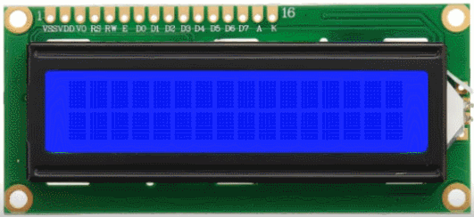
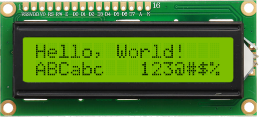
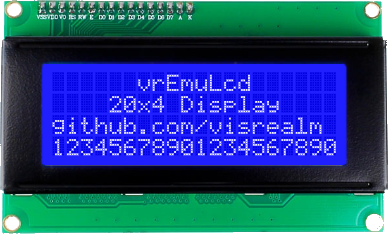
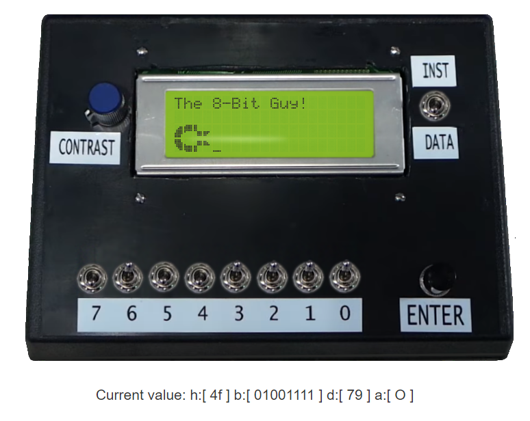

# vrEmuLcd - HD44780 Character LCD Emulator

Core engine written in C with a flexible Web front-end.

This Character LCD Emulator can be used to emulate most standard LCD displays.

It accepts and responds to most commands listed in the [HD44780 datasheet](https://www.sparkfun.com/datasheets/LCD/HD44780.pdf)

## Screenshots:

#### Hello, World!

#### Different Colors

#### Different Sizes

#### Custom characters (CGRAM support)

## Live examples:

* [Hello, World!](https://visrealm.github.io/vrEmuLcd/examples/helloworld)
* [The 8-Bit Guy: Character LCD](https://visrealm.github.io/vrEmuLcd/examples/8bitguy)
* [Troy's Breadboard Computer!](https://cpu.visualrealmsoftware.com/emu/?h=7e387e0c7e01370730b800b801bdebbdc20f48b1bd7f4e07bd81b805b8061701ba040b4703ccc0b80307b3c050323937c0da392b40b8044f02b1bd7f4f05b1495704ce71bd76b9058a0abd7f4f02bd7f4e4956fa3e61bdd94f0317fddaba022f6c4f06b149bd7f4ebd76b9067ecc4701fc4700fc2f22c107eff83e7e0fbd6ebdabc0b017a4ce0a491730da014eb0ce0a174ace0740d4f0460f07d80f01e039a3cd2f9d010a49d00a88fc6e17f0070fd8da0f0ef83cb7780a17bdb5b5b5cd3fc1c16e7e80078a0f1050fec0e13ec87ec00f0a50fec0e13ed26e4700c00f3af83ee84701c0b8010730b8006e0740f00f0a074ab05182fec0c172fa3ef3566e0000000064000000000000000f08080808080808080808080808080f1f00000000000000000000000000001f1f00000000000000000000000000001f1e02020202020202020202020202021e0f08080808080808080808080808080f1f00000000000000000000000000001f1f00000000000000000000000000001f1e02020202020202020202020202021e2054544c2020000204062053636f7265536e616b6521010305070302011514131211252423222135343340f080ff1010200100000000000000000000000000000000000000000000000000000000000000000000000000000000000000000000000000000000&s=300)

## Usage

#### HTML
    
    
    //...
#### latest (github)
    
    
    //...
    
## Example

    <canvas id="lcd"></canvas>
    ...
    var canv = document.getElementById('lcd');
    var ctx = canv.getContext('2d');
    
    vrEmuLcd.setLoadedCallback(function () {

      // create a new LCD object
      var lcd = vrEmuLcd.newLCD(16, 2, vrEmuLcd.CharacterRom.Eurpoean);
      
      // set up the display
      lcd.sendCommand(LCD_CMD_DISPLAY | LCD_CMD_DISPLAY_ON);
      
      lcd.writeString("Hello, World!");
      
      lcd.render(ctx, 0, 0, 800, 400);
    });

## LCD API

#### constuctor
`var lcd = vrEmuLcd.newLCD(columns, rows, charSet);`  
- `columns`: - number of columns
- `rows`: - number of rows
- `charSet`: - character set. One of: `vrEmuLcd.CharacterRom.European`, `vrEmuLcd.CharacterRom.Japanese`

#### sendCommand(commandByte)
`lcd.sendCommand(data);` - send a command to the instruction register of the lcd

Command constants are defined:
- `LCD_CMD_CLEAR` - clear the display

- `LCD_CMD_HOME` - reset display to home position

- `LCD_CMD_ENTRY_MODE` - entry mode (the following to be bitwise-OR'd)
  - `LCD_CMD_ENTRY_MODE_INCREMENT` - automatically increment the cursor or display
  - `LCD_CMD_ENTRY_MODE_DECREMENT` - automatically decrement the cursor or display
  - `LCD_CMD_ENTRY_MODE_SHIFT` - automaticallt shift the entire display instead of the cursor

- `LCD_CMD_DISPLAY` - display mode (the following to be bitwise-OR'd)
  - `LCD_CMD_DISPLAY_ON` - turn the display on
  - `LCD_CMD_DISPLAY_CURSOR` - display a cursor (bottom row)
  - `LCD_CMD_DISPLAY_CURSOR_BLINK` - display a blink cursor (flashing entire character block)

- `LCD_CMD_SHIFT` - move the cursor or scroll display (the following to be bitwise-OR'd)
  - `LCD_CMD_SHIFT_CURSOR` - shift the cursor (default)
  - `LCD_CMD_SHIFT_DISPLAY` - shift the display
  - `LCD_CMD_SHIFT_LEFT` - shift the cursor or display left (default)
  - `LCD_CMD_SHIFT_RIGHT` - shift the cursor or display right

- `LCD_CMD_SET_CGRAM_ADDR` - set the CGRAM address (actual address uses lower 6 bits)

- `LCD_CMD_SET_DRAM_ADDR` - set the CGRAM address (actual address uses lower 7 bits)

#### writeByte(dataByte)
`lcd.writeByte(dataByte);` - write a byte to the data register of the lcd

#### writeString(str)
`lcd.writeString(str);` - write a string to the data register of the lcd

#### getDataOffset(screenX, screenY)
`lcd.getDataOffset(screenX, screenY);` - return the ddram offset for the given screen location

#### readByte()
`lcd.readByte();` - read the current byte from cgram or ddram (determined by current address) 

#### readAddress()
`lcd.readAddress();` - read the current address offset in cgram or ddram

#### pixelState(pixelX, pixelY)
`lcd.pixelState(pixelX, pixelY);` - return the pixel state at the given location
- `-1` - no pixel (eg. margin)
- `0` - pixel off
- `1` - pixel on

#### colorScheme
`lcd.colorScheme = vrEmuLcd.Schemes.WhiteOnBlue;` - set the color scheme
Standard color schemes:
- `vrEmuLcd.Schemes.WhiteOnBlue` (default)
- `vrEmuLcd.Schemes.BlackOnBlue`
- `vrEmuLcd.Schemes.BlackOnGreen`
- `vrEmuLcd.Schemes.RedOnBlack`
- `vrEmuLcd.Schemes.BlueOnBlack`

or, provide your own. `{ BackColor: <backcolor>, PixelOnColor: <pixeloncolor>, PixelOffColor: <pixeloffcolor> }`

#### render(ctx, x, y, width, height)
`lcd.render(ctx, x, y, width, height);` - render to a 2d canvas context
- `ctx` - the canvas to render to

## License
This code is licensed under the [MIT](https://opensource.org/licenses/MIT "MIT") license
